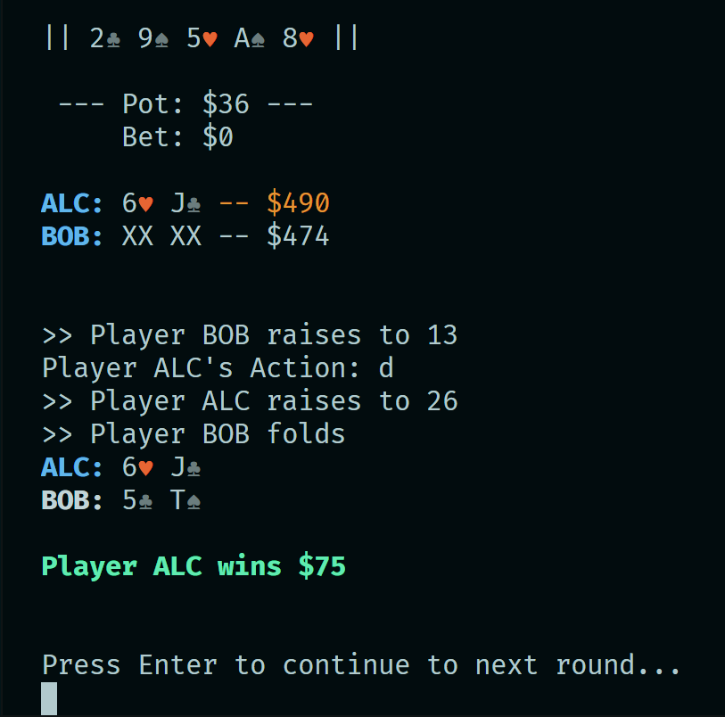
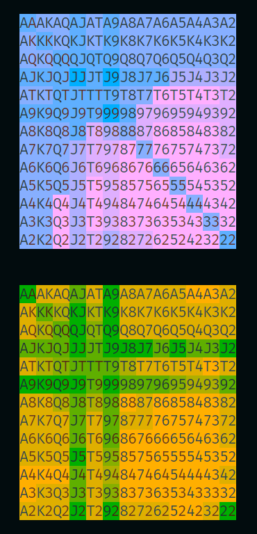

# pokervis
## A framework for building, backtesting and battling poker bots

### Features:
- Extremely fast bitshift hash-based 7-card Hold 'em evaluation
- Tooling for visualising rank pair ranges and performing weighted sampling
- Range-based equity inference to incorporate Bayesian updates, value bets and bluffs 
- Backtesting class for grid searching on pokerbot params (coming soon) 


### Getting Started:
```rust
use pokervis::holdem;

fn main() {
     let mut game = HoldemGame::new(vec![
        Player::new("ALC".to_string()),
        Player::new("BOB".to_string()),
    ]);

    game.play_rounds(5, true);
}
```

#### Game in progress


<hr>

#### Range visualisation

